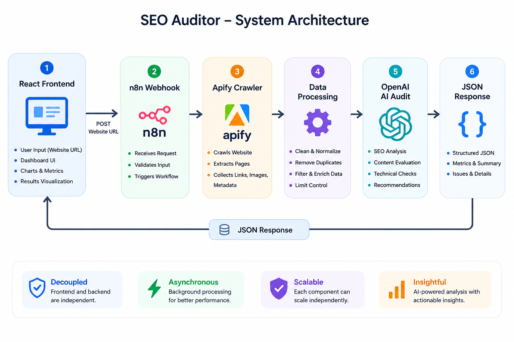

<div align="center">

# AI-Powered Website SEO Auditing Platform

Automatically crawl websites, analyze technical SEO, detect structural issues, and generate AI-powered recommendations through an automated pipeline built with **React**, **n8n**, **Apify**, and **OpenAI**.

<br>


</div>

---

# Overview

SEO Auditor is an automated website auditing platform that combines web crawling, workflow automation, and generative AI to evaluate a website's technical SEO health.

The application follows a decoupled architecture where the React frontend submits a website URL to an n8n workflow. The workflow orchestrates website crawling through Apify, processes the collected data, leverages OpenAI for SEO analysis, and returns a structured JSON response that powers an interactive dashboard.

---

# System Architecture

<p align="center">
    
</p>

---

# Key Features

### Automated Website Crawling

* Crawl complete websites
* Discover internal and external pages
* Extract metadata
* Analyze page structure

### AI-Powered SEO Analysis

* Technical SEO recommendations
* Content quality analysis
* Heading validation
* Crawlability checks

### Website Health Monitoring

* Broken link detection
* Broken image detection
* Image optimization analysis
* Page statistics

### Interactive Dashboard

* Multi-page audit reports
* SEO summary
* Interactive charts
* Detailed issue breakdown

### Automation Pipeline

* Fully automated workflow
* Asynchronous processing
* Structured JSON responses
* Easily extendable architecture

---

# How It Works

The platform executes the following workflow for every audit request.

### 1. Website Submission

The user submits a website URL from the React dashboard.

↓

### 2. Workflow Trigger

The frontend sends the URL to an n8n Webhook which orchestrates the complete auditing pipeline.

↓

### 3. Website Crawling

Apify crawls the website and extracts:

* Pages
* Internal Links
* External Links
* Images
* Metadata

↓

### 4. Data Processing

The workflow processes the crawl results by:

* Removing duplicate URLs
* Filtering unnecessary information
* Limiting crawl size
* Preparing structured data

↓

### 5. AI SEO Audit

OpenAI analyzes the processed data and generates:

* Technical SEO findings
* Best practice validation
* Website summary
* Optimization recommendations

↓

### 6. Response Generation

n8n formats the audit into a normalized JSON response.

↓

### 7. Dashboard Visualization

The React application displays:

* SEO metrics
* Audit summaries
* Charts
* Broken links
* Image analysis
* Recommendations

---

# Technology Stack

| Layer            | Technology   |
| ---------------- | ------------ |
| Frontend         | React        |
| Workflow Engine  | n8n          |
| Website Crawling | Apify        |
| AI Analysis      | OpenAI       |
| Charts           | Recharts     |
| Icons            | Lucide React |

---

# Installation

## Backend Configuration

### Import Workflow

Import the provided workflow into your n8n workspace.

### Configure Apify

Add your Apify API Token to the **Run SEO Audit Tool** node.

### Configure OpenAI

Add your OpenAI API Key to the **Audit Message Model** node.

### Development Webhook

```text
http://localhost:5678/webhook-test/website-audit
```

---

## Frontend Setup

Clone the repository.

```bash
git clone <repository-url>

cd <project-folder>
```

Install dependencies.

```bash
npm install

npm install lucide-react recharts
```

Configure the webhook URL.

Development

```text
http://localhost:5678/webhook-test/website-audit
```

Production

```text
https://your-domain.com/webhook/website-audit
```

Run the development server.

```bash
npm run dev
```

---

# Deployment

Before deploying the application:

* Activate the n8n workflow.
* Replace `/webhook-test/` with `/webhook/`.
* Configure CORS for the production frontend.
* Verify API credentials.
* Test the production webhook endpoint.

---
</div>
